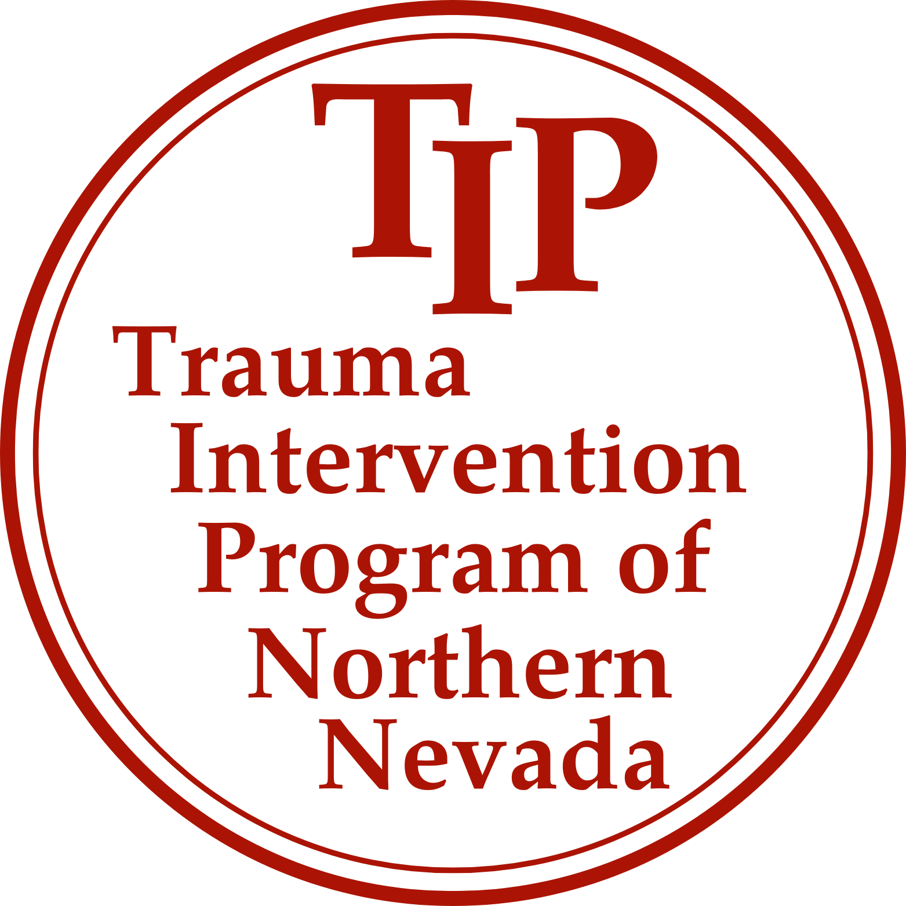

# Trauma Intervention Program of Northern Nevada - Resource Guide

{: style="height:250px;width:250px"}

__For emergencies please call [911](tel:911) immediately. If you have questions or need assistance from TIP please call our 24/7 number: [(775) 745-5514](tel:7757455514). For more information about our program please visit our main website at [tipnnv.org](https://tipnnv.org)__

## What we have to offer

-   :fontawesome-solid-heart-pulse: [__Coping After a Tragedy__](coping-after-a-tragedy.md)
    
    ---

    * Dealing with loss
    * Common reactions following trauma
    * Dealing with emotions – Resolving grief
    * Helping children grieve
    * Helping children deal with suicide
    * Dealing with suicide

    [:octicons-arrow-right-24: Learn More](coping-after-a-tragedy.md)

-   :material-hand-heart: [__Emotional First Aid__](emotional-first-aid.md)
    
    ---

    * Helping the emotionally injured after a tragedy
    * What to say
    * What not to say
    * How can you help later

    [:octicons-arrow-right-24: Learn More](emotional-first-aid.md)

-   :fontawesome-solid-notes-medical: [__Coroner's Office__](coroner's-office.md)
    
    ---

    * What they do
    * Why they do it

    [:octicons-arrow-right-24: Learn More](coroner's-office.md)

-   :material-file-document-edit: [__Handling Estates/Paperwork__](handling-estates.md)
    
    ---

    * Practical consideration
    * Papers and certificates
    * Insurance policies
    * Social Security
    * Veteran’s benefits
    * Employee Benefits
    * Wills and probate
    * Taxes and general finances

    [:octicons-arrow-right-24: Learn More](handling-estates.md)

-   :material-fire-hydrant: [__Fire__](fire.md)
    
    ---

    * Fire information
    * What to do
    * What not to do

    [:octicons-arrow-right-24: Learn More](fire.md)

-   :fontawesome-regular-newspaper: [__Media__](media.md)
    
    ---

    * Dealing with media – Your rights

    [:octicons-arrow-right-24: Learn More](media.md)

-   :fontawesome-regular-newspaper: [__Recursos en Español__](recursos-en-espanol.md)
    
    ---

    * Resources in Spanish

    [:octicons-arrow-right-24: Aprende más](recursos-en-espanol.md)

-   :fontawesome-regular-newspaper: [__Support Services Directory__](support-services-directory.md)
    
    ---

    * Organization near you that can support you including:
        * Grief Support
        * Burial/Cremation Assitance
        * Many More...

    [:octicons-arrow-right-24: Aprende más](support-services-directory.md)

